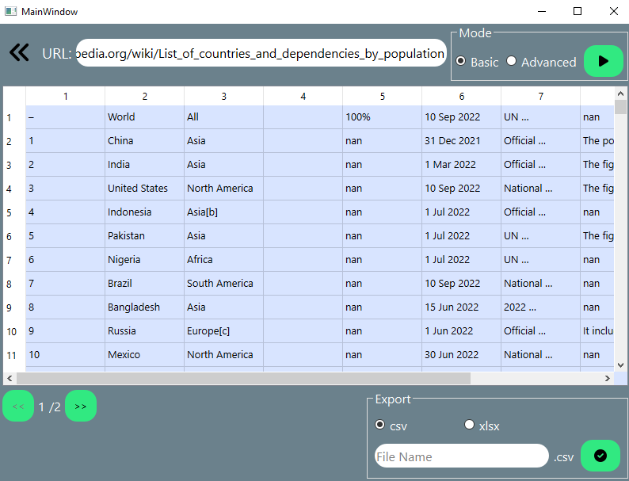
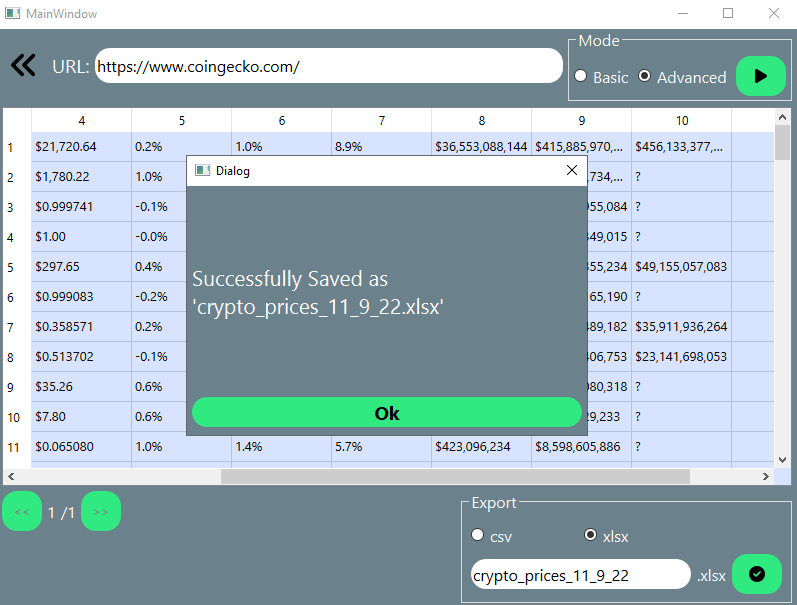

# Micro-Apps
## Python-based tools for automating some operations.

## Usage:
    
1. navigate to the project directory
2. install dependencies
    ```
    pip install -r requirements.txt
    ```
3. start the program
    ```
    python main.py
    ```
    OR
    ```
    python -m main.py
    ```


## - <a href='https://github.com/Abdelrahman-tlayjeh/Micro-Apps/tree/main/folder-organizer'>Folder Organizer:<a/>
A tool that automates some files management tasks.

<p float="left">
    
    
</p>
  
  
## - <a href='https://github.com/Abdelrahman-tlayjeh/Micro-Apps/tree/main/tables-scraper'>Tables Scraper:<a/>
A tables scraping tool for both static and dynamic websites.

<p float="left">
    
    
</p>
